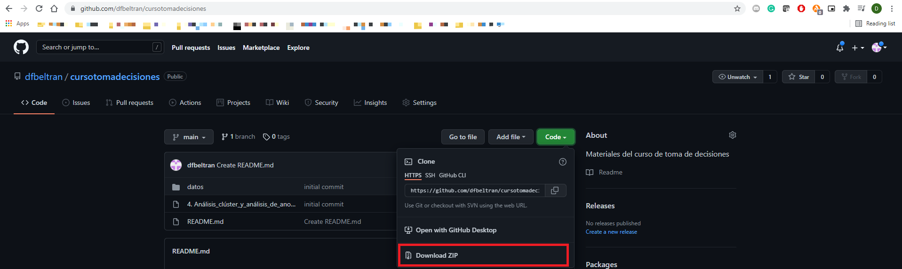
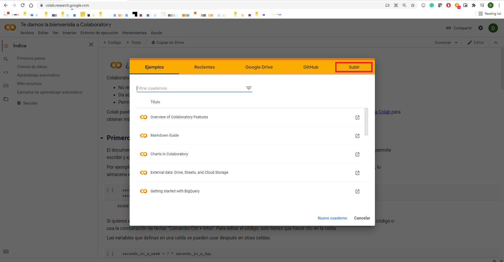
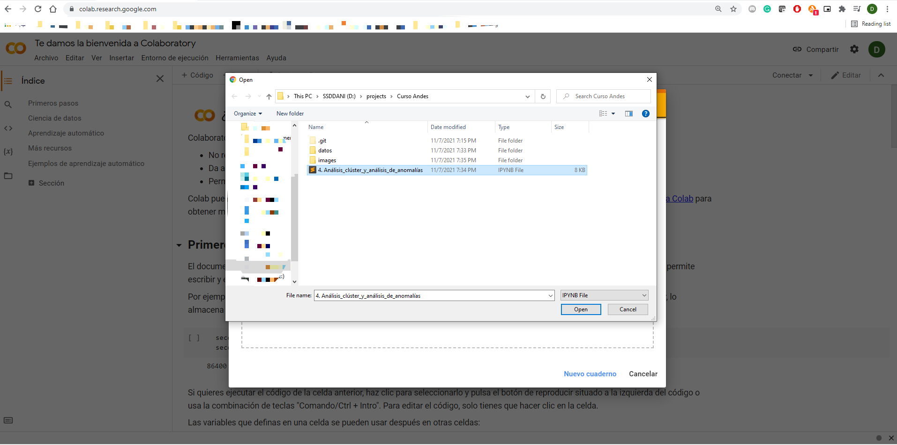
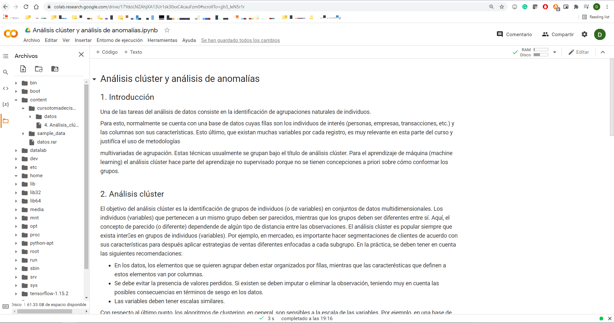

# Toma de decisiones basadas en datos

Para hacer uso de este repositorio se sugiere seguir los siguientes pasos:

1. Clonar el repositorio o descargarlo como ZIP en su computador. Si se requiere descargar como ZIP y no se tienen conocimientos en GIT se tiene que dar click donde dice Code y luego en  Descargar como ZIP.    Este proceso descargará todos los archivos de datos y scripts.

2. Para no tener que crear un ambiente de Python y descargar todos los paquetes se sugiere usar Google Colab. Para hacer uso de esta herramienta ingresamos a https://colab.research.google.com/ y damos click en la opción **SUBIR**

3. Exploramos la carpeta del curso y subimos el notebook que deseamos ejecutar. 

4. Dentro del Notebook se tiene programado para que obtenga los recursos que requiere para ejecutarse. Por lo tanto nada más queda ejecutar el código.   En las pestañas superiores se puede ejecutar todas las celdas y/o se puede ejecutar celda a celda usando `SHIFT + ENTER`

